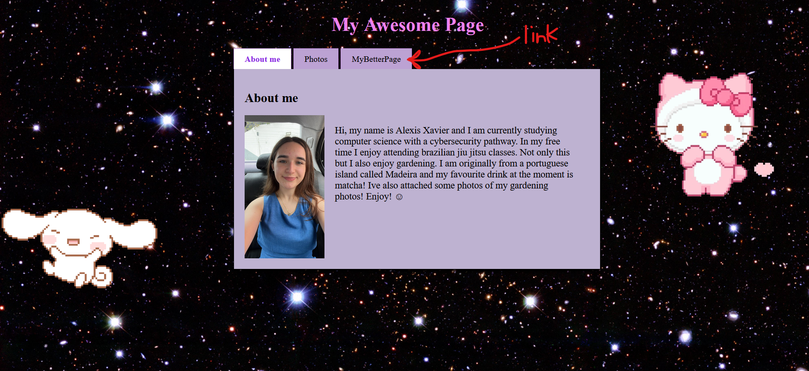
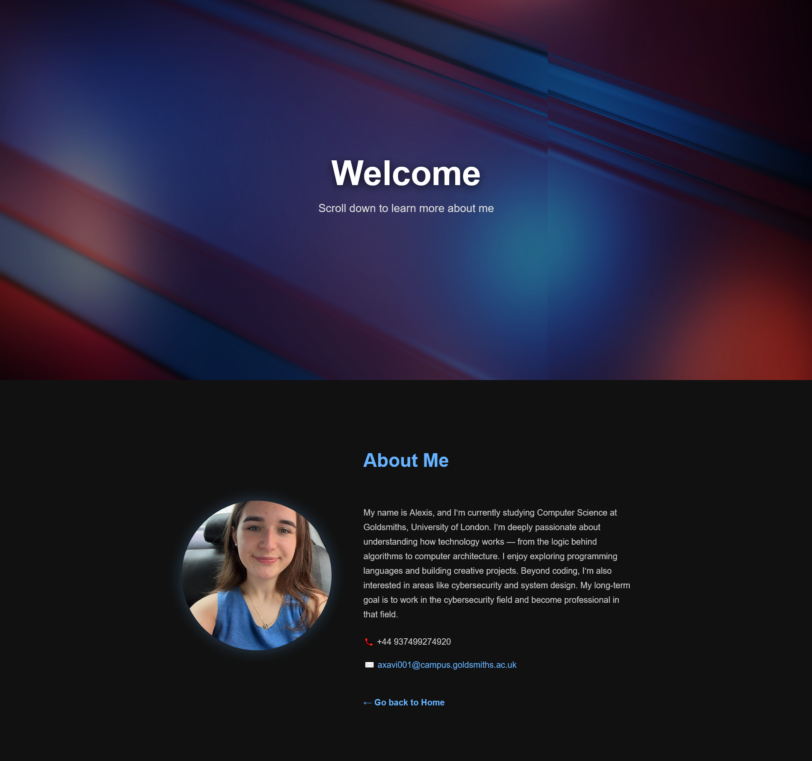

<h1>🌐 My Awesome Page — Node.js Personal Website</h1>

A personalized webpage powered by a custom-built Node.js server.
Features an About Me section, a gallery of gardening photos, and browser detection to deliver a unique experience for Chrome users.

<h2>How It's Made:</h2>
 🧰 Built With

[![HTML5][HTML5-shield]][HTML5-url]
[![CSS3][CSS3-shield]][CSS3-url]
[![JavaScript][JavaScript-shield]][JavaScript-url]
[![Node.js][NodeJS-shield]][NodeJS-url]

[HTML5-shield]: https://img.shields.io/badge/HTML5-E34F26?style=for-the-badge&logo=html5&logoColor=white
[HTML5-url]: https://developer.mozilla.org/en-US/docs/Glossary/HTML5

[CSS3-shield]: https://img.shields.io/badge/CSS3-1572B6?style=for-the-badge&logo=css3&logoColor=white
[CSS3-url]: https://developer.mozilla.org/en-US/docs/Web/CSS

[JavaScript-shield]: https://img.shields.io/badge/JavaScript-F7DF1E?style=for-the-badge&logo=javascript&logoColor=black
[JavaScript-url]: https://developer.mozilla.org/en-US/docs/Web/JavaScript

[NodeJS-shield]: https://img.shields.io/badge/Node.js-339933?style=for-the-badge&logo=nodedotjs&logoColor=white
[NodeJS-url]: https://nodejs.org/

Here is a list of the tools I used to build this application. Each played an important role in bringing the project together, through structuring and styling the webpages to adding interactivity and functionality with JavaScript. Node.js was used to create a custom server for hosting and handling user requests, allowing the site to run dynamically and efficiently.Through the use of these tools altogether, it enabled me to develop a responsive, user-friendly website that showcases both design and technical elements.

<h2>Screenshots of my work</h2>
<h3> MyPage</h3>

When linked it clicked on, it will refer you to my better page where you can see the updated changes. 

<h3> MyBetterPage</h3>Pag

This is my new updated better page, with a moving motion background video.

<h2>🌍 Link to My Webpage</h2>
<a href="http://www.doc.gold.ac.uk/usr/278/" target="_blank">Visit my webpage here</a>
